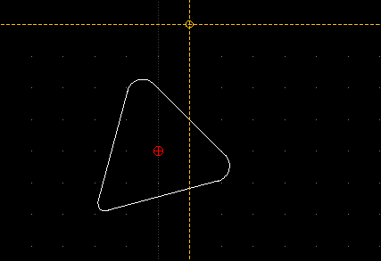
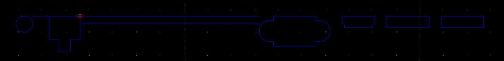
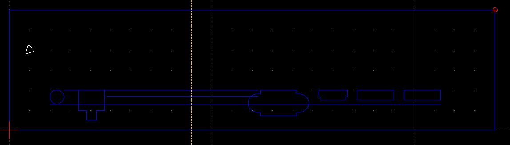
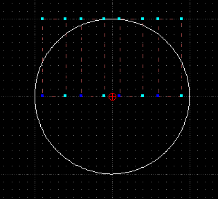
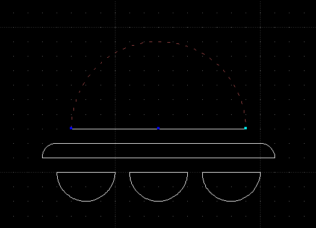
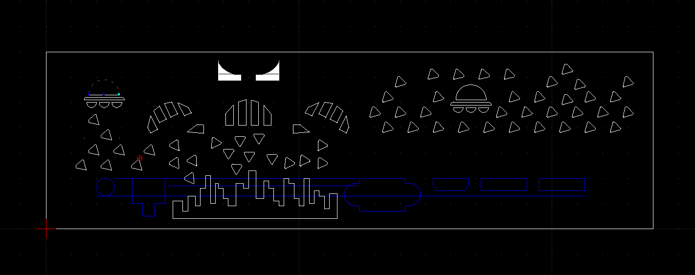
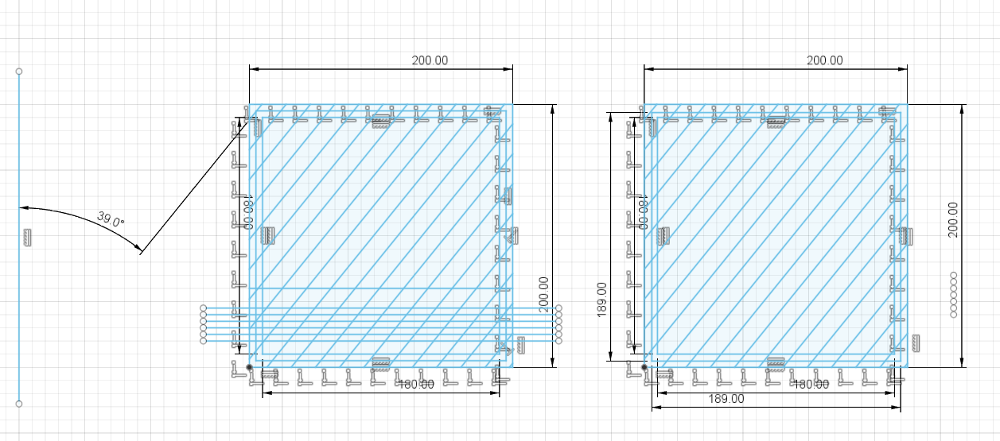
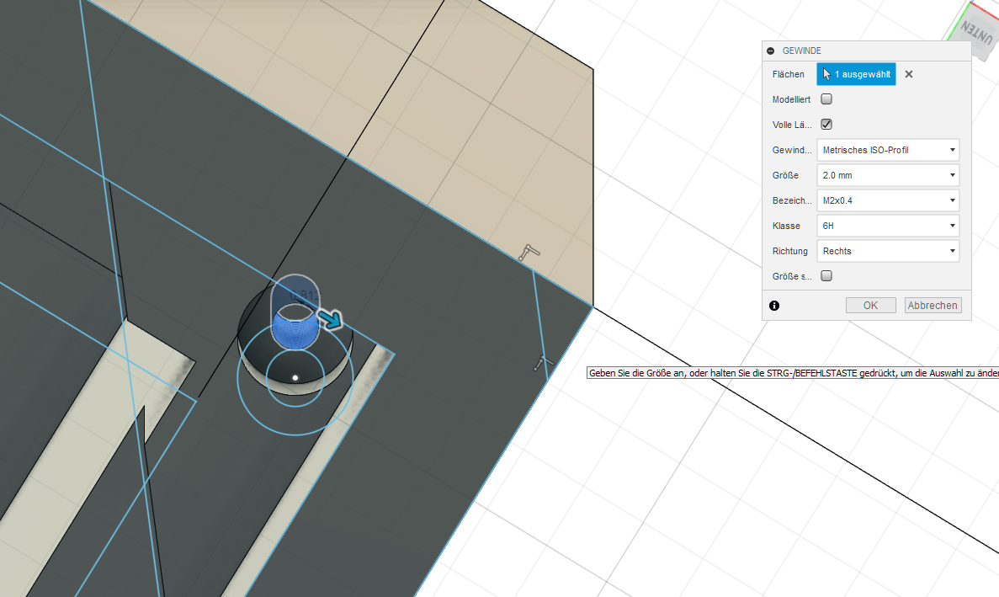
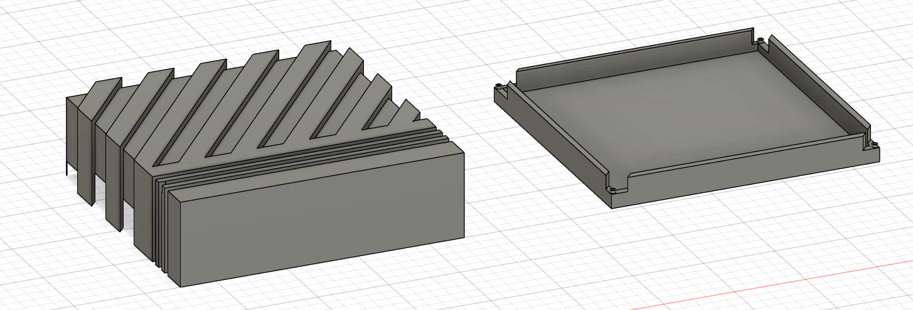

% 2D and 3D CAD basics

This document will outline some basic projects which have been created using Computer Aided Design (CAD) software. As an example using 2D CAD methodologies it will document the creation of a template sketch for a three-dimensional object constructed out of simple two-dimensional plates using the LibreCAD software.

As project for a two-dimensional CAD design, you will read about the creation of an I/O shield design using standard measurements for common connector types such as VGA and USB. For three-dimensional CAD work, you will read about a sketch-based creation of a simple two-part lunchbox.

All sources will once again be available on [the repository](https://github.com/zibonbadi/zibonbadi.github.io/tree/main/download).

## 2D CAD with LibreCAD

First I created a rectangle of size 200mm &times; 70mm as a basis for the I/O shield. Afterwards I began work on a pattern for air holes in the shield, since it's use in rather compact cases require it to facilitate as much airflow as possible.

Out of a bit of creative insight I decided to create a pattern inspired by the arcade games "Asteroids" and "Space Invaders", using the ports as an aesthetic component. The first "spaceship was set to be a simple triangle with fillets. For this I created a triangle of radius 2 &times; 2 with two fillets of radius 0.5mm and one fillet of 0.25mm to suggest a pointy front.

After taking a few measurements from my laptop (Samsung NP350E7C) I followed up with creating all necessary ports. Below is a list of general measurements for each:

- Power connector: Circle of diameter 7mm (2-point circle tool)
- RJ-45 (Ethernet): 2-point line as shape combined from two rectangles. 13mm &times; 10mm rectangle with a 5mm &times; 5mm rectangle placed at the bottom center, outer sides touching. Measurements have been applied liberally as to allow easy disconnection of a cable.
- VGA: Rectangular area 18mm &times; 13mm with extensions of 6mm left and right each; 2mm inwards on each side. Created using the 2-point line tool constructing from a base rectangle. Circular area created using fillet and mirrored to the other side.
- HDMI: 2-point line based on a 18mm &times; 5mm rectangle. 3mm from bottom, additional indents of 1mm &times; 1mm diagonal narrow the bottom 1mm height portion.
- USB: Rectangle 18mm &times; 5mm

Each of the ports were spaced about 5mm apart, except one: the RJ45/Power pair. While the distance between the two ports, distance between the RJ45 and VGA ports was about 75mm, as this space was reserved for the heatsink and vent. I simply decided to measure this distance using a fixed-length horizontal line.

When connecting the pieces I discovered that the ports wouldn't align with the expected precautious padding of 2cm, so I extended the rectangle to 24cm width:

For the vent holes above the heatsink I wanted to create an eye-catching mothership, so first I constructed the face by using 2-point tool based lines (as normal rectangles aren't trimmable) and a construction circle for trimming. Missing sides have been filled in using 2-point lines: 

I also decided to build a UFO for a bit of visual interest. I created it by cutting circles using the divide tool as well as creating a 2-point based rectangle with fillets:

Below you can see the final result:

The final design is also available for download[^2dcad]

## 3D CAD with Autodesk Fusion 360
   
As exercise I decided to create a two-part lunchbox in an industrial style of a size of 20cm x 20cm x 7cm (the final model will be 6cm in height as I intend the design to be securable using feet screws of an estimated height of 1cm). 
Inspiration for this design came from the [Commodore Amiga 500](https://en.wikipedia.org/wiki/Amiga_500) and [Atari 1040ST](https://en.wikipedia.org/wiki/Atari_ST) home computers.
The final design can be downloaded through the footnotes[^3dcad]

First I started a sketch by laying out a base plane of 20cm by 20cm size, followed by two more squares with base size of 19cm x 19cm and 18cm x 18cm respectively. For alignment I used simple grid snapping. Afterwards I drew a 39° angle left of the 20cm square using the line and measurement tools which I applied a rectangular pattern to so that it covers the entire square in an evenly spread pattern.

After trimming the excess lines off for cleanliness I copied the base square over to the right and adjusted the right patterns 19cm square to a size of 18.9cm, such that the two halves will fit onto each other without issue.

After creating a secondary pattern for the front of the top half (using another rectangular pattern of horizontal lines) it was finally time to make my 2D sketch into a 3D model: First I extruded the entire sketch into a solid 20cm x 20cm x 5.5cm box.

Afterwards I created the groove patterns: Additively for the top by extruding select shapes up 6cm in connect/merge mode, then subtractively on the sides by extruding select shapes on the outside up 6cm in cut mode.

For making my lunchbox actually able to contain things, I needed to make it hollow inside as well as plan out a design to fit both sides of the box together: First I extruded the 18cm x 18cm square up 5cm in cut mode to hollow out the containment area. Next and finally for the top half, I extruded (cut mode) the are between the 18cm an 19cm squares to act as the inside walls of the lunchbox; 2cm up for the sides and 1cm up for the corners.

Now to the bottom side: Much like the top side I first created a -4.9cm extrusion as a base box to work with. Much like the 19cm inside square, I cut out 1mm as wiggle room for snugly fitting the halves onto each other. Afterwards I once again cut out the 18cm square as storage space followed by similarly extruding the walls in cut mode such that their height would be 0.9cm on the corners and 1.9cm on the sides.

As an afterthought I came up with the idea of letting the lunchbox stay on screw feet as an eye-pleasing way of securely locking it, so I modified the bottom halfs sketch by adding a nubbed screwhole of 4mm nub circumference (thankfully both sketches were exactly 30cm apart so I could copy the holes over to the other one precisely). After extruding the holes into each part appropriately Fusion 360 automatically settled for a 6H M2x0.4 right-turning winding for the top half. The bottom half did not receive a winding as it was not necessary and would've resulted in unnecessary screwing effort on behalf of the potential user.

Below you can see a screenshot for the final result:

[^2dcad]: [Download link for the 2D CAD sketch at the repository](../download/Case01%20v12.f3d).
[^3dcad]: [Download link for the 3D CAD sketch at the repository](../download/ioshield.dxf).
