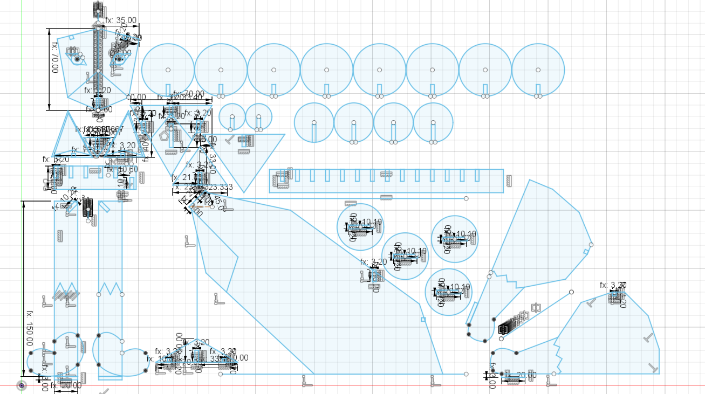

# Parametric design and Laser cutting

This time we're diving into the basics of parametric CAD design and laser cutting. The parametric design will be a foundational sketch for a small laser cut model made of wood. This model will also feature engravings as both excercise and visual effect.

## Parametric Design

For this excercise I decided to create a simple geometric model of a fox, which will be "textured" using different engravings. The final can be found here[^cadsketch].

Due to it's three-dimensional, joint-based approach our model will be fairly complex, thus I will try to simplify explaining some of the components' designs as the main focus lies on how parametric design automates and structures it. Just as a primer, you can see the final spreadsheet down below:

Also keep in mind that not all decisions in a parametric design can be entirely automated. Depending on the type of material used, manual adjustments need to be made. For design purposes I assumed the following:

- 3mm wood plates
- No bendings (as bending patterns might have complicated the design further)
- 0.2mm Kerf (will be explained later on)

### The head

Let's start off with something rather simple, then. Below you can see the fox' face plate and ears. The square shapes at the top of the head as well as the bottom of the ears serve as joints and have been measured *MaterialThickness+Kerf* for each side, with parallel constraints to ensure clean and consistent insertion despite odd angles. All the other inner shapes have been defined to serve as reference points for engravings later on:

As fox faces are not flat of course, below you can see the snout, which has been designed with a size of

Below the ears we encounter the first of what I refer to as *bones*. These are little helper pieces which are supposed to serve complex joints between similarly orientated cuts, since the suspected 3mm wood we're about to use for assembly is unable to safely bend without use of complex patterns.

For assembly all three snout pieces as well as the face plate are meant to be mounted on the aforementioned snout bone. The sole down-facing notch to the right will serve mounting the face to the rest of the body, as will soon be explained.

### The torso and the legs

Designing the torso turned out a tricky as precise measurements were needed across various angled joints to ensure a stable resting position of the torso and feet.

To connect head and front feet to the torso, I created a shoulder bone with 4 joints:

- Two at the lower sides for the legs: `(MaterialWidth+Kerf)&times;((BoneWidth/2)+Kerf)`. The legs have been adjusted to fit in a 45deg angle with the shoulder bone
- One at the top for the snout bone: `(MaterialWidth+Kerf)^2^`
- One in the middle for the torso to connect: `(MaterialWidth+Kerf)&times;((BoneWidth/2)+Kerf)` 

The front legs I created using some rectangles and a spline. At the top you can see the aforementioned shoulderbone connection and at the bottom you can see connection joints for a set of stands that I decided to create for better standing. For the legs' thickness I used the regular bone thickness just in case of necessary adjustments:

For stable standing I also created four standing plates for the feet to fit into. They are of 20mm radius with a slot in the middle of `(MaterialWidth+Kerf)&times;((BoneWidth/2)+Kerf)`. :

Designing the Legs turned out to be a mostly non-parametric procedure, as the complex shape only served aesthetics, aside from a few necessary joints.

Below you can see the hip bone, which has been used to connect the two hindleg pieces to the main torso:

### The tail

For the tail I designed a tail bone (visible at the bottom of the image below) which would stick perpendicular into the fox' back with circles of 3 sizes stuck onto it, suggesting volume.

The gaps have been defined through a rectangular pattern on the bone and snapping with defined distance between the circle's midpoint and one of the gap's corners for centering in case of the "bushes". The gaps' size has been defined using standard proportions (MaterialWidth, Kerf and BoneWidth/2:

### Final sketch

## Laser Cutting
   
*Coming soon*

[^cadsketch]: [Download link for the fox model sketch](../download/foxfigure.dxf)
