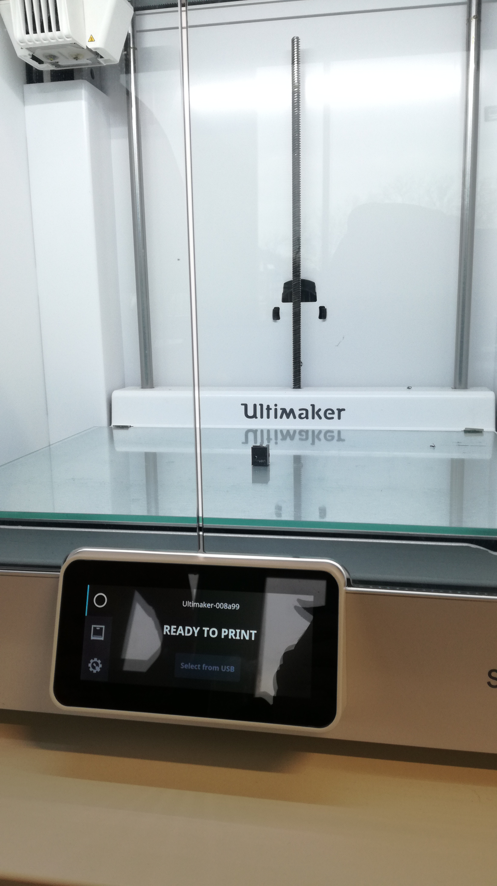

% 3D printing a corner joint

[^cornerproject]: [Fusion 360 project download](../download/cornerpiece_test1.f3d)
[^gcode]: [gCode file download](../download/UMS5_case2_cornerpiece1_test1.gcode)
[^stlmodel]: [STL model download](../download/case2_cornerpiece1.stl)

This time we're diving into the basics of parametric CAD design and laser cutting. The parametric design will be a foundational sketch for a small laser cut model made of wood. This model will also feature engravings as both excercise and visual effect.

## Designing the piece

Once again I decided to design the corner joint in Fusion 360. Below you can see a sketch of the top view, which I extruded as a base to work with:

The Fusion 360 project file[^cornerproject] is available for download.

## Printing the piece
   
### Preparation in Cura

Generally there was little issue regarding overhang and support. *Generally*. More on that later. As for settings, I used the standard settings for generic PLA material using an Ultimaker S5 printer. Deviances are listed in the table below:

|Variable|Value|
|--|--|
|Layer height| 0.2mm|
|Wall line count| 8|
|Top layers| 2|
|Infill density| 100%|
|Infill pattern| Tri-Hexagon|
|Build plate adhesion type| Skirt|

To some readers these values might not have much meaning, so I'll explain some of them shortly: I used a Layer height of 0.2mm to control the calculated kerf from the 3D CAD model such that the final print will be close to how it was designed in software. Furthermore I used a wall layer count of 8 with an infill density of 100% and a Tri-hexagon infill pattern to increase the print's stability/sturdiness (as mathematically speaking triangles and hexagons have some of the most equal distributions of force for any wire/grid structure). Lastly I added a skirt adhesion to the build plate, just to be able to safely remove the piece once it has finished printing without risking damage.

Once again, the exported STL model[^stlmodel] and finished gCode file[^gcode] are available for download.

### Final result

After the final piece was finished, it looked a bit fragile, but turned out quite sturdy, likely due to the 100% infill density. However, there seemed to be a printing failure on the overhang of one of the sides, which rendered the inner screwhole unusable:

Testing the piece on the corner of a 3mm wooden plate, attachment was already sturdy and tight, such that the additional planned screw might not even be necessary in the final project. Just for added structural security, I'm still going to keep it though.

