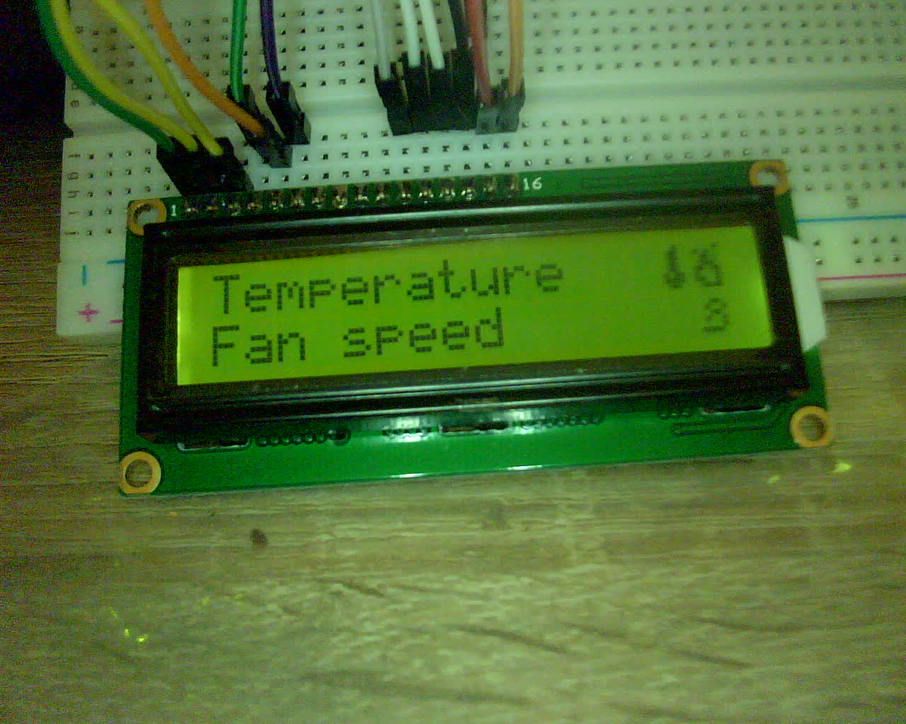

% Connecting a character display

[^dlsrc]: [LCD test source code](../src/lcddisplay/lcddisplay.ino)

## Introduction

As it is gonna be useful for diagnostic information in my final PC case project, I decided to hook up a 1602A compatible LCD character display to the Arduino

## Wiring up the display

The 1602A features 16 pins of which the first 6 are meant to control the display itself:

1. GND
2. VCC
3. Vo/Analog LCD contrast
4. RS (Register Select): Control whether to send commands (e.g. cursor control, custom character overwrites) or data (characters, pixel bytes). This is wired to pin 12 on the Arduino.
5. Read/Write mode: Apparently the 1602 is able to transmit the character it managed to display currently back. As this display is mainly meant as an output device though, I simply wired it to GND, eternally putting it in LOW/output mode.
6. Enable: Basically a "lock" to prevent accidental writes e.g. due to electrical noise. This was wired to pin 11 on the Arduino.

The following 8 pins are data pins, meant for transmitting character and custom character pixel bytes, while the last two pins are the anode and cathode for the LED-based backlight.

As spec-wise the 1602A is also operational in 4-bit mode (via nibble split, even though this results in slower display frequencies) I decided to save some pins on the Arduino and wire it up in 4-bit mode. The overall wiring can be seen below:


As the wiring is quite messy, let me try to explain it a little further, so that you'll hopfully be able to understand it:

I used the breadboard to create a common parallel line of 5V VCC and GND, as the assembly consists of multiple devices (potentiometer and two pairs of power pins for the display and it's backlight respectively).

As the display's backlight is seemingly LED-based, it's power supply pins are labeled as anode and cathode on the last two pins of the device. The backlight also uses a lower voltage, necessitating the use of a resistor for the anode, as otherwise the circuit overloads and risks component damage.

For controlling the contrast, I simply wired up a potentiometer to the breadboard's main power line and wired the output into Vo (contrast/pin 3 on the 1602A).

## Programming the display

As the 1602A LCD display is essentially it's own microcontroller which needs to be communicated with, the best approach to programming it involves the `LiquidCrystal` library, which I simply installed through the library manager.

After setting it up, below you can see the code I wrote to display some basic information and test out some custom characters on the display. Of course, it is once again available for download[^dlsrc]:

```C
// include the library code:
#include <LiquidCrystal.h>


byte temp[8] = {
0b00100,
0b01100,
0b01100,
0b01100,
0b01100,
0b10110,
0b11110,
0b01100
};
byte fan[8] = {
0b00000,
0b00110,
0b01001,
0b00110,
0b01001,
0b00001,
0b11110,
0b00000
};

byte fire[8] = {
0b00001,
0b10100,
0b01100,
0b01110,
0b11011,
0b10001,
0b11001,
0b01111
};


// Creates an LCD object. Parameters: (rs, enable, d4, d5, d6, d7)
LiquidCrystal lcd(12, 11, 5, 4, 3, 2);

void setup() 
{
  // display dimensions (16x2)
  lcd.begin(16, 2);

  // dejunkification
  lcd.clear();

  //load custom characters into the LCD's RAM
  lcd.createChar(0, temp);
  lcd.createChar(1, fan);
  lcd.createChar(2, fire);
}

void loop() 
{
  //basics
  lcd.setCursor(0, 0);
  lcd.print("Temperature");
  lcd.setCursor(0, 1);
  lcd.print("Fan speed");

  //custom characters
  lcd.setCursor(14, 0);
  lcd.write(byte(0));
  lcd.write(byte(2));
  lcd.setCursor(15, 1);
  lcd.write(byte(1));
}
```

As visible in the photograph below, the character display and custom character setup both work fine:


