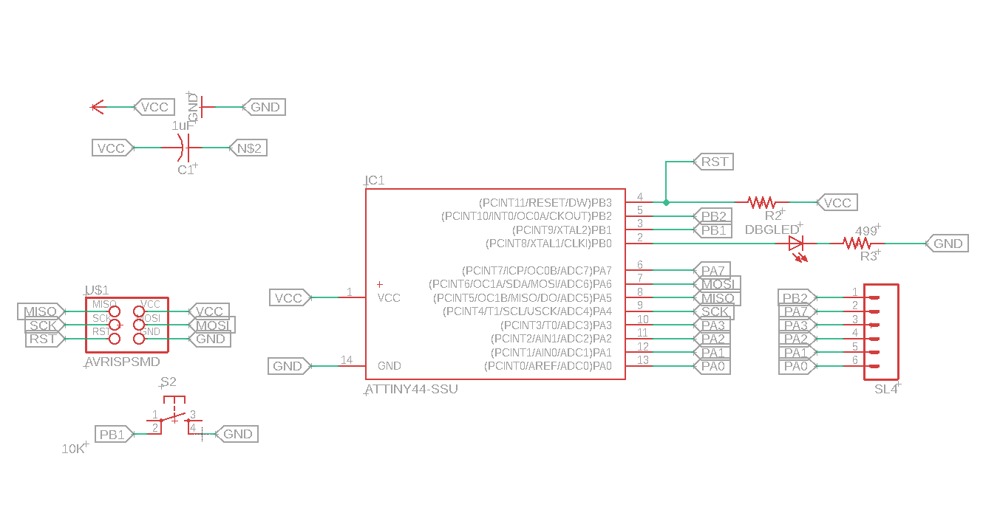
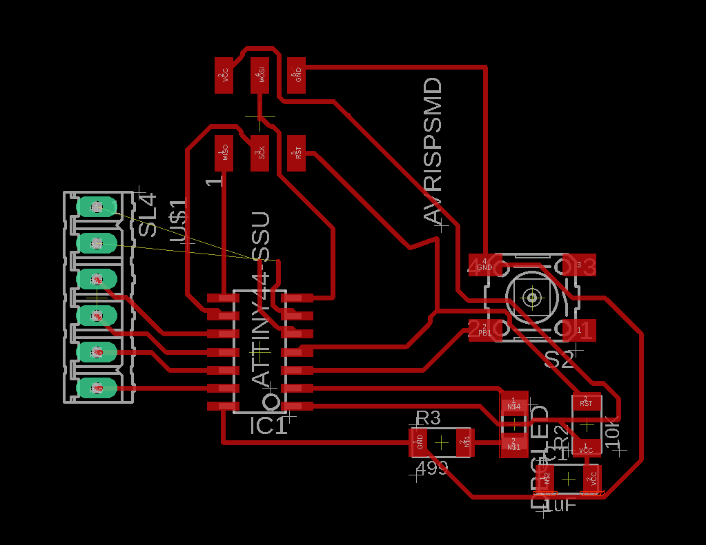

% Electronics design

[^dlpcb]: [PCB design download](../download/fabpcb.zip)

## Introduction

As the use of various electronic components, such as sensors, displays and lights within the final projects can result in a mess of wires and cable management, it is appropriate to simplify the circuitry using a custom designed PCB. This is especially useful, as the case's components are meant to be largely independent of the motherboard and power supply used inside of it and the reduction of cable management increases servicability and airflow.

However, for production environments you'd usually try to get everything printed onto the same board, such that everything is simplified towards your specific design goals without unnecessary excess. Because of this I will outline a process of designing a PCB around the Atmel ATTINY44 (which is a chip commonly used in Arduino controllers) using Autodesk EAGLE.

## Designing the schematic

The final schematic ended up quite simple, so I think I can explain it entirely using the image below:

## Designing the traces

For this exercise we settle on a machine that is capable of creating traces of at least 12mil thickness with an atmil of 16mil. The unit mil, contrary to common belief does *not*  signify a measurement in milimeters here, but rather 1/100th of an inch. In the Image below you can see my solution for the traces:

Sadly as the atmil was not precise enough, I ended up not being able to connect the output pins PA7 and PB2 (loose traces in the middle), as there is logically no safe way to connect these without the use of a 2nd layer.
