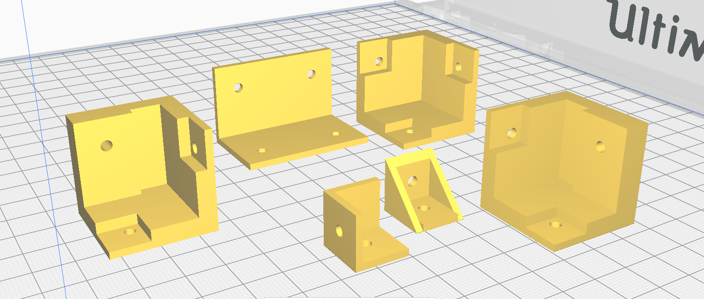

% Final Project: Creating a Mini PC case

[^dlcad]: [Fusion 360 project](../download/final/pccases.f3d)
[^dl8mmr1]: [8mm sketch R1](../download/final/8mmr1.dxf)
[^dl3mmr1]: [3mm sketch R1](../download/final/3mmr1.dxf)
[^dl8mmr2]: [8mm sketch R2](../download/final/8mmr2.dxf)
[^dl3mmr2]: [3mm sketch R2](../download/final/3mmr2.dxf)
[^dl3to8r]: [3to8r custom piece](../download/final/3to8_r.stl)
[^dl3to8l]: [3to8l custom piece](../download/final/3to8_l.stl)
[^dl3plate]: [3plate outer corner piece](../download/final/3plate.stl)
[^dlcorner2i]: [corner3i inner corner piece](../download/final/corner2i.stl)
[^dlcorner3i]: [corner3i inner corner piece](../download/final/corner3i.stl)
[^dlcorner2o_long]: [corner2o_long outer corner piece](../download/final/corner2o_long.stl)
[^dlcode]: [Arduino project](../src/lcdtemp/lcdtemp.ino)
[^dlvid]: [Showcase video download](../img/final/docvid.webm)

This document will explain the creation of my final FabLab course project, a mini PC case featuring an old laptop motherboard with integrated electronics for measuring and displaying system temperature.


All designs and components needed will be linked for download in their appropriate sections. For convenience, you can also get the direct references at the bottom of the document.

## Inspiration

![Showcase of the (semi) final case[^dlvid]](../img/final/docvid.webm)

Alright, this is it. The final project. Countless possibilities when you can control everything from physical construction over electronics to microcontroller programming. But what do?

When I started this course, I did so with the intention of passing it having gained not only knowledge, but also a holding a physical object in my hands which I could use on a day-to-day basis.

I previously mentioned being a proud Linux user, a system that to this day gained a dedicated, but niche following among desktop computer users, mainly through word of mouth. Because of this, there are many reasons someone might "get into" Linux in the first place.

For me this reason was preserving old technology. As me and my family never had a lot of spare cash, I've learned to cherish any piece of precious (expensive) technology I manage to get hold of and use it until it's absolutely not possible anymore, then fix it, then use it again, 20 GOTO 10. However, when I first installed Manjaro on my laptop I encountered two problems which even Linux wasn't able to fix. Overheating (which can be mitigated, thanks to `thermald` and I haven't had a thermal shutdown since ;p) and a case which was slowly falling apart.

Thus I decided to finally address these problems myself by building a custom case which warned me of overheating during runtime and allowed me to easily work on my laptop's old mainboard if needed.

As everything design-wise originates from one Fusion 360 project, it's download will be linked in this footnote[^dlcad].

## Design goals and parts list

The case I am trying to build will have to meet certain criteria, both for passing the course as well as for my own personal use case:

- The case requires fitting the following components inside
		  - Mainboard
		  - Power button
		  - Audio/SD I/O PCB
		  - ~~Activity light PCB~~ The activity light is integrated into the trackpad PCB and thus not usable in this case, hence it won't be used.
- The optical drive is optional but "nice to have"
- A custom backplate suited towards the laptop's I/O
- A feet-based "floating" design to increase airflow at the bottom and reduce overheating
- Strict separation between the case's measurement electronics and the laptop's components
- An easy way to remove the laptop's PCB and service it without taking apart the entire case
- Ambient lighting at the bottom of the case to indicate activity in an aesthetically thought-out way.
- A heat sensor for measuring the CPU temperature
- A way to display the measured CPU temperature
- A microcontroller for interfacing between the above mentioned components

The final parts required to build this case ended up being the following:

- My Laptop. Duh.
- 3mm/8mm wood for the laser-cut 
- A roll of PLA for 3D-printing the stabilizing corner pieces
- M3x16 case screws and M2.5 screws for the motherboard (as I am taking my laptop apart, it will supply these already)
- M3-compatible feet
- Cables solder and a Luster terminal for connecting the electronics
- An Arduino Uno. I used a selfbuilt clone in the final case, but tested on an official one.
- An MLX90614ESF infrared temperature sensor
- A WS2812B-based programmable LED strip
- A 1602A-compatible LCD character display
- A Potentiometer and Button for controlling the LCD display's properties (contrast, backlight)

## Designing the case

### Laser cutting

For the walls I decided to use a combination of 8mm wood for the base frame, joints and certain base plates with 3mm plates screwed on top, as it allows easy customization and part mounting while facilitating airflow and potentially easier routing of cables. For joints I decided to connect all adjacent parts into one unified shape. While this might risk a looser cut when a wider kerf is appplied, this approach ensures full interconnectivity of the parts without computationally intensive constraints, such as colinearity.

All sketches have been designed parametrically using Autodesk Fusion 360 with some finishing touches being applied in LibreCAD. The final case ended up being 25cm &times; 25cm &times; 7cm of internal space, a quite generous measurement, as for a long time I didn't have access to my laptop's mainboard (as I needed to write this very doc on it):

![8mm wood sketch in LibreCAD[^dl8mmr1]](../img/final/wood8r1.png)

![3mm wood sketch in LibreCAD[^dl3mmr1]](../img/final/wood3r1.png)

As you may notice, the 3mm plates feature a lot of equally distributed 3mm holes. These serve two functions: On one hand they're meant to allow heat to rise out of the top of the case, improving (or at least not hindering) system temperature. Second these holes are meant to serve as mounts for all measurement electronics, as it provides an easy method for having the entire top including all electronics to be independent of the rest of the case and easily removable for serviceability.

After exporting the case walls' sketch into DXF format, I got it cut. Sadly I can't show you the exact settings as I had to commission someone else to do it externally due to COVID-19 related restrictions.

After I received my parts however, I realized a few mistakes in the sketch: As you may see the top floor's base plate (where the mainboard is supposed to be mounted) was nothing but a cutout and a frame (featuring incorrect joints on one side at that), so it had to be adjusted.

I also took some unlucky measurements around the front plate: from an earlier prototype based almost solely on 8mm plates I thought I had to make the potentiometer hole bigger, however I just found myself unable to mount it this way and additionally the LCD display's hole was measured around incorrect dimensions. Once again, I adjusted this part.

Instead of spending another 3 days ripping my hair out at Fusion 360 refusing to work with the constraints I gave it, I decided to simplify my design (as the WS2812B was not usable) and make necessary customizations using a good old drill saw and file combo.

All recomissioned parts can be seen below:

![8mm wood sketch in LibreCAD: R2[^dl8mmr2]](../img/final/wood8r2.png)

![3mm wood sketch in LibreCAD: R2[^dl3mmr2]](../img/final/wood3r2.png)


### 3D printing

Overall the case's parts were designed to be mostly interchangeable, which applies particularly to the 3D printed parts of the case. Just for extra structure I decided that although the applied box joints provide plenty structure on their own, I was gonna 3D print some additional corner pieces to connect all wooden walls with screws.

Generally I designed three types of 3D printed ABS corner pieces:

1. Outer corners[^dl3plate][^dlcorner2o_long]
2. Inner corners[^dlcorner2i][^dlcorner3i]
3. Custom pieces (3to8 pieces)[^dl3to8r][^dl3to8l]



All parts were designed by first laying out a somewhat complex sketch which was then extruded multiple times to achieve a consistent 3D model in Fusion 360.

Just as with the laser cut wood, I am sadly unable to show you any settings as I had to commission the preparation 3D printing outside due to COVID-19.

After assembly I started to notice that the application of outer corners for mounting ended up being quite cumbersome and provided comparatively little structural support. Combined with the necessarily limited length of the screws used (M3x16mm), I decided to favor inner corner pieces over outer ones (although outer corners still needed to be applied for connecting the two main levels of the case).

## Electronics wiring

The plan for the electronics seemed simple: Tap into the laptop's power socket, adjust the power coming from it and let an old Arduino Uno run the measurement eqipment, with a 19V to 5V stepdown transformator to hook into the Arduino's DC. However as you will read later, there were a few issues along the way. For now have this table with how everything was wired up logically:

| Arduino pin | Component pin |
|---|---|
| +5V | 1602A VSS; 1602A A (over resistor); Potentiometer 10K&Omega; |
| GND | 1602A VDD; 1602A RW; 1602A K; Potentiometer; MLX90614ESF GND, RGB Cathode (later), Reset button (even later) |
| RST | Reset button (later) |
| +3.3V | MLX90614ESF VIN |
| A4 | MLX90614ESF SDA |
| A5 | MLX90614ESF SCL |
| Digital 2 | 1602A D7 |
| Digital 3 | 1602A D6 |
| Digital 4 | 1602A D5 |
| Digital 5 | 1602A D4 |
| Digital 7 | WS2812B (over resistor) |
| Digital 9 | RGB red (later) |
| Digital 10 | RGB green (later) |
| Digital 11 | RGB blue (later) |
| Digital 12 | 1602A E |
| Digital 13 | 1602A RS |

Additionally I wired the potentiometer's output pin to the 1602A's VO (contrast) pin, as well as a button inbetween the 1602A's anode and the resistor applied to VCC beforehand.


First issue was the MLX90614ESF: As the Arduino I used was *not* an original, the PCB didn't expose a 3V3 pin. Although it sounds like a non-issue in hindsight, it took quite a while to find out that the sensor actually supported being run over 5V, although less precisely so. However as I am building a PC case rather than using it medically, this restricion won't matter all too much.

Additionally I wasn't able to use the WS2812B light strip as it had too large of a power draw to be used in conjunction with the MLX90614ESF *and* the 1602A. As a solution I used a regular 4-pin RGB LED and reprogrammed the Arduino accordingly.

## Microcontroller programming

As the parts used are fairly common among Arduino hobbyists, the source code[^dlcode] ended up rather simple, given you install the `LiquidCrystal` and `Adafruit MLX90614` libraries. One thing to note here is that PC temperature sensors usually bump their reports by 20°C, likely due to how long it takes a heat sink to dissipate the heat given to it.:

```C
// include the library code:
#include <LiquidCrystal.h>
#include <Adafruit_MLX90614.h>
#include <Wire.h>

#define RED 9
#define GREEN 10
#define BLUE 11

//Define custom characters
byte temp[8] = {
0b00100,
0b01100,
0b01100,
0b01100,
0b01100,
0b10110,
0b11110,
0b01100
};
byte fan[8] = {
0b00000,
0b00110,
0b01001,
0b00110,
0b01001,
0b00001,
0b11110,
0b00000
};

byte ambient[8] = {
0b00000,
0b00000,
0b01110,
0b10001,
0b10101,
0b10001,
0b01110,
0b00000
};

byte fire[8] = {
0b00001,
0b10100,
0b01100,
0b01110,
0b11011,
0b10001,
0b11001,
0b01111
};


// Init LCD display. Parameters: (rs, enable, d4, d5, d6, d7)
LiquidCrystal lcd(13, 12, 2, 3, 4, 5);
//Init MLX temp sensor
Adafruit_MLX90614 mlx = Adafruit_MLX90614();

unsigned int milicounter = 0;

void setup() 
{
  // display dimensions (16x2)
  lcd.begin(16, 2);
  mlx.begin();
  
  pinMode(RED, OUTPUT);
  pinMode(GREEN, OUTPUT);
  pinMode(BLUE, OUTPUT);
  
  // dejunkification
  lcd.clear();

  //load custom characters into the LCD's RAM
  lcd.createChar(0, temp);
  lcd.createChar(1, ambient);
  lcd.createChar(2, fire);
  lcd.createChar(3, fan);
}

void loop() 
{
  milicounter = (milicounter+1)%1000;
  //CPU temperature is usually bumped by 20°C in statistics. This is likely a factor compensating for different heatsinks
  float objTemp = mlx.readObjectTempC()+20.0f;
  float ambientTemp = mlx.readAmbientTempC();
  
  static byte r=255,g=255,b=255;

  //Color calc
  if(objTemp >= 40.0f){ r=0; g=255; b=255; }
  if(objTemp >= 50.0f){ r=0; g=127; b=255; }
  if(objTemp >= 60.0f){ r=255; g=127; b=0; }
  if(objTemp >= 70.0f){ r=255; g=63; b=0; }
  if(objTemp >= 80.0f){ r=255; g=0; b=0; }


  /*
   *  Output
   */

  //Buffer clear
  lcd.setCursor(0, 0);
  lcd.print("                ");
  lcd.setCursor(0, 1);
  lcd.print("                ");
  
  //Icons
  //temp
  lcd.setCursor(0, 0);
  lcd.write(byte(0));
  lcd.print(objTemp);
  //ambient
  lcd.setCursor(0, 1);
  lcd.write(byte(1));
  lcd.print(ambientTemp);
  //fire
  lcd.setCursor(14-4, 0);
  lcd.print("1000 ");
  lcd.write(byte(3));

  //Display colors
  analogWrite(RED,r);
  analogWrite(GREEN,g);
  analogWrite(BLUE,b);
}
```
